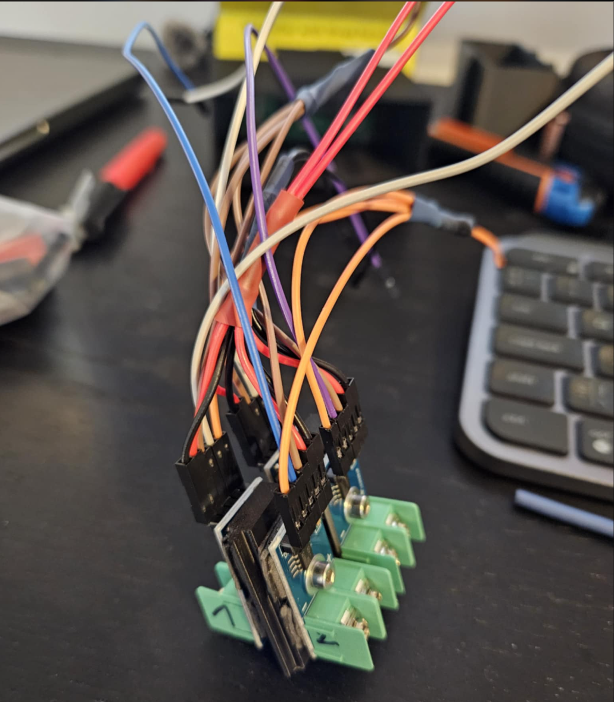
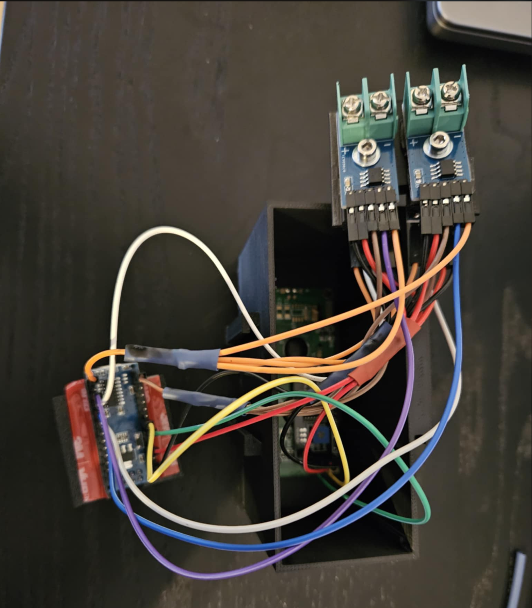
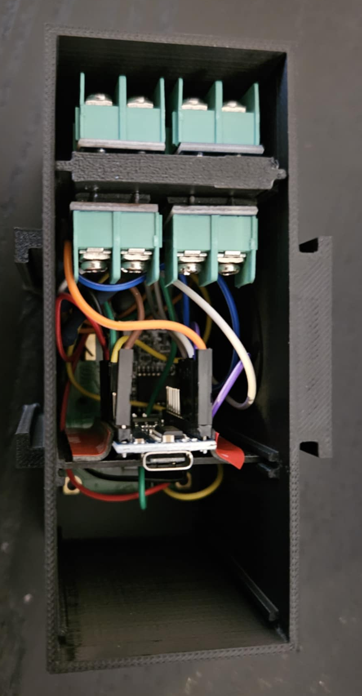
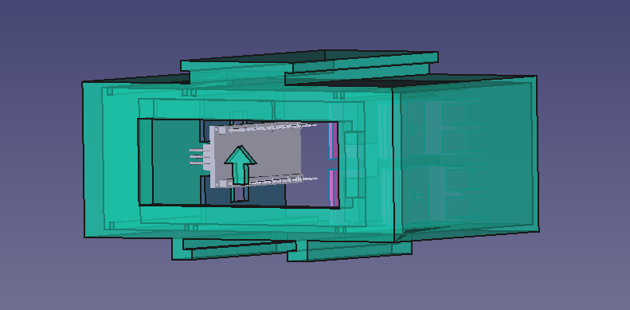
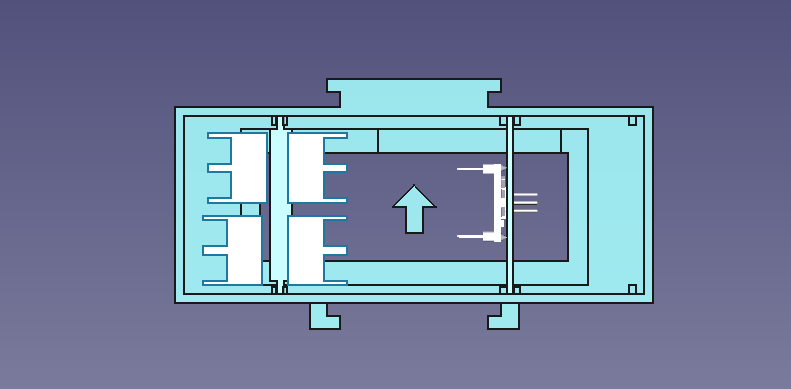

# EGT HD44780 Display #

EGT display using Arduino with HD44780 screen and four MAX6675 EGT amplifiers

## Preview ##

### In car ###

### MAX6675 modules with wiring ###

### Back of the case, modules exploded ###

### Back of the case, all modules inside ###

## Mounting in the car ##

It is designed to lock on to supports and to be able to be stacked together with EMU dash
from: https://github.com/bogumilbierc/ecumaster-emu-hd44780-display

## Elements ##

- Arduino Nano
- 4 x MAX6675
- HD44780 LCD with I2C interface
- 4 EGT K-Type probes

## Powering in the car ## 

It is designed to be powered via the USB port using a regular car charger.

## Arduino IDE setup ##

- Install LiquidCrystal_I2C library
- Install MAX6675 (by Adafruit)

## Hardware connections ##

### Arduino <> Display ###

| Arduino | Display |
|---------|---------|
| 5V      | VCC     |
| GND     | GND     |
| A4      | SDA     |
| A5      | SCL     |

### Arduino <> MAX6675 ###

| Arduino | MAX6675 #1 | MAX6675 #2 | MAX6675 #3 | MAX6675 #4 | 
|---------|------------|------------|------------|------------|
| 5V      | VCC        | VCC        | VCC        | VCC        |
| GND     | GND        | GND        | GND        | GND        |
| D13     | SCK        | SCK        | SCK        | SCK        |
| D12     | SO         | SO         | SO         | SO         |
| D7      | CS         | -          | -          | -          |
| D8      | -          | CS         | -          | -          |
| D9      | -          | -          | CS         | -          |
| D10     | -          | -          | -          | CS         |

## Case ##

Case is a FreeCad project that can be 3D printed.

### Preview ###

